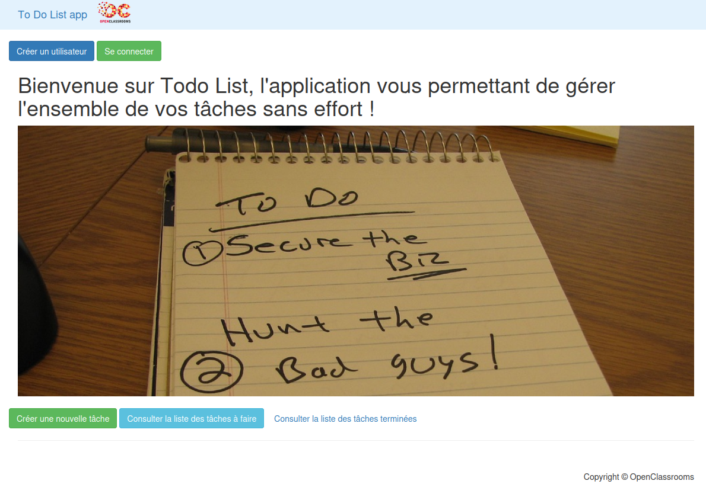
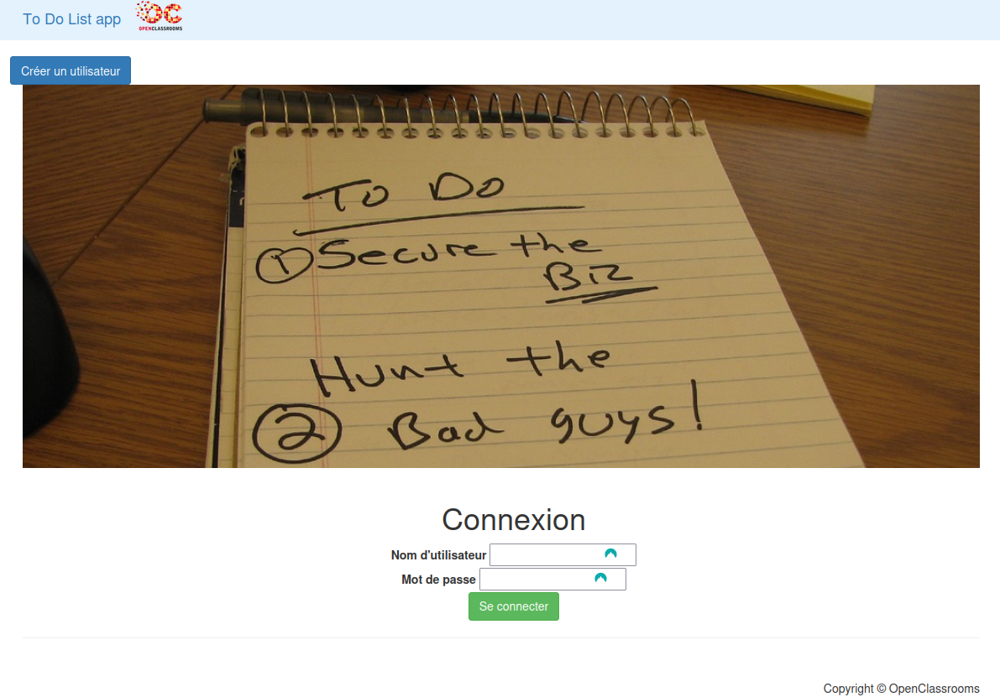
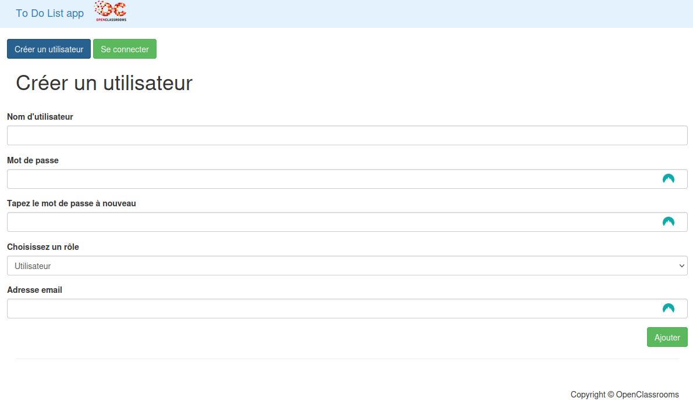
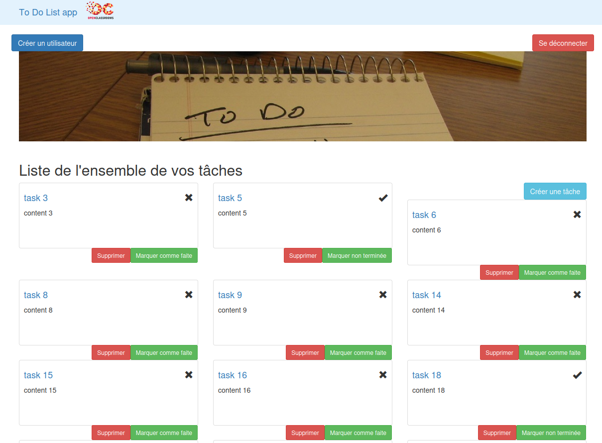
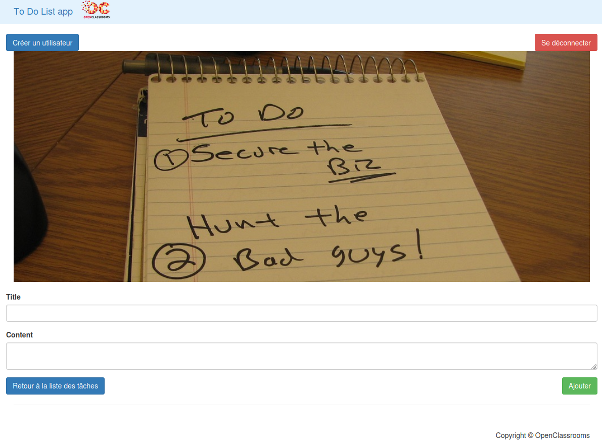
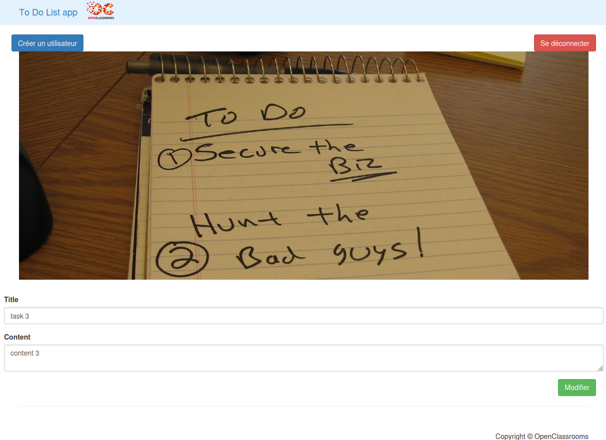
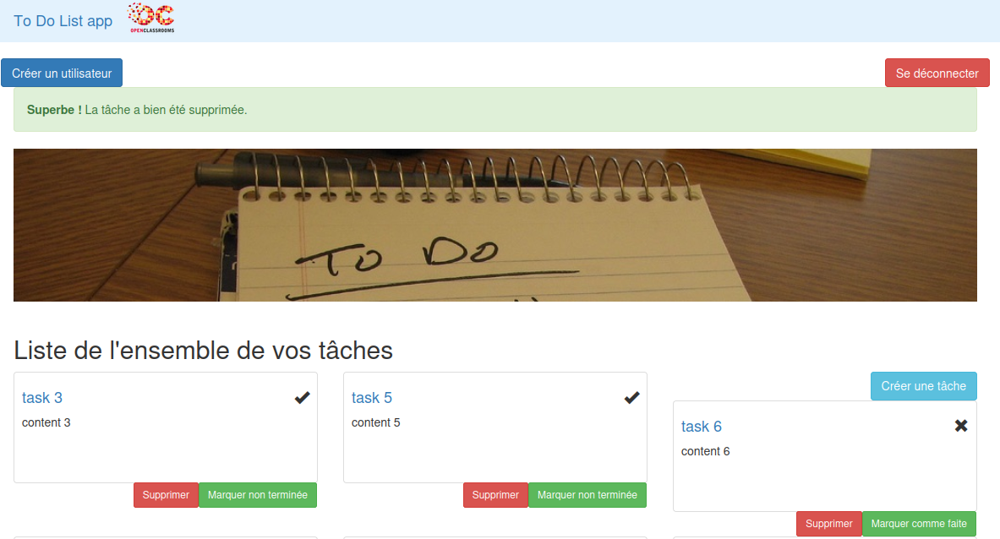
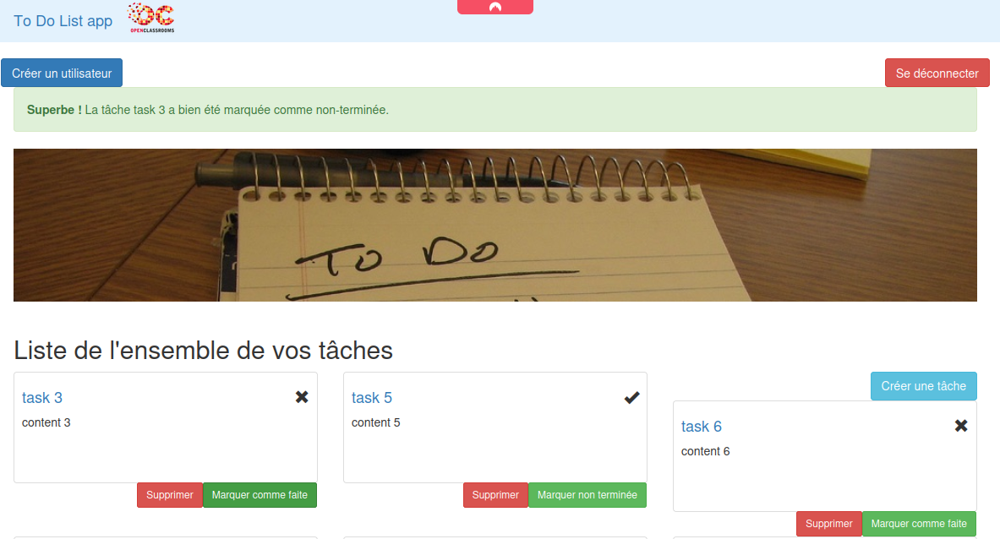

<h1 align="center">
  <a href="https://github.com/tomcdj71-openclassrooms/todolist">
    <!-- Please provide path to your logo here -->
    
  </a>
</h1>

<div align="center">
  TodoList
  <br />
  <a href="#about"><strong>Explore the screenshots »</strong></a>
  <br />
  <br />
  <a href="https://github.com/tomcdj71-openclassrooms/todolist/issues/new?assignees=&labels=bug&template=01_BUG_REPORT.md&title=bug%3A+">Report a Bug</a>
   · 
  <a href="https://github.com/tomcdj71-openclassrooms/todolist/issues/new?assignees=&labels=enhancement&template=02_FEATURE_REQUEST.md&title=feat%3A+">Request a Feature</a>
</div>

<div align="center">
<br />


|  | |
|---|---|
| **CI/CD** | [](https://github.com/tomcdj71-openclassrooms/todolist/actions/workflows/build_and_test.yaml)  |
| **Analysis** | [](https://app.codacy.com/gh/tomcdj71-openclassrooms/todolist/dashboard?utm_source=gh&utm_medium=referral&utm_content=&utm_campaign=Badge_grade) |
| **Community** | [](https://github.com/tomcdj71-openclassrooms/todolist/issues?q=is%3Aissue+is%3Aopen+label%3A%22help+wanted%22)  |
| **Mainteners** | [](https://github.com/tomcdj71) |
| **Open&#160;Source** | [](https://github.com/tomcdj71-openclassrooms/todolist/blob/main/LICENSE) |
| **Tools** | [](https://github.com/Everduin94/better-commits) |

</div>

<details open="open">
<summary>Table of Contents</summary>

- [About](#about)
  - [Built With](#built-with)
- [Getting Started](#getting-started)
  - [Prerequisites](#prerequisites)
  - [Installation](#installation)
  - [Alternative Installation](#alternative-install)
- [Usage](#usage)
- [Support](#support)
- [Project assistance](#project-assistance)
- [Contributing](#contributing)
- [Authors & contributors](#authors--contributors)
- [Security](#security)
- [License](#license)

</details>

---

## About

> **NOTE**
> TodoList is my 8th project of my OpenClassrooms courses for being an Application Developer (PHP/Symfony).
> The goal is to update a legacy PoC app and prepare it for the future !
> The app is a simple To-Do list app made with Symfony 6, that can be tested via PHPunit.
> You can see more about this project by clicking in the [docs](./docs/todoco.pdf).


<details>
<summary>Screenshots</summary>
<br>

|                                                    Home Page                                                    |
| :-------------------------------------------------------------------------------------------------------------: |
|                         |

|                                                   Login Page                                                    |
| :-------------------------------------------------------------------------------------------------------------: |
|          |

|                                                Create User Page                                                 |
| :-------------------------------------------------------------------------------------------------------------: |
|         |

|                                                 Tasks List Page                                                 |
| :-------------------------------------------------------------------------------------------------------------: |
|            |

|                                                Task Create Page                                                 |
| :-------------------------------------------------------------------------------------------------------------: |
|         |

|                                                 Task Edit Page                                                  |
| :-------------------------------------------------------------------------------------------------------------: |
|               |

|                                                Task Delete Page                                                 |
| :-------------------------------------------------------------------------------------------------------------: |
|         |

|                                                Task Toggle Page                                                 |
| :-------------------------------------------------------------------------------------------------------------: |
|         |

</details>

<details>
<summary>Diagrams</summary>
<br>

|         TYPE        |       PREVIEW       |
| :-----------------: | :-----------------: |
| MPD · drawio        | [MPD]               |
| Classes · plantuml  | [Classes]           |
| Sequence · plantuml | [Add Task]          |
| Sequence · plantuml | [Delete Task]       |
| Sequence · plantuml | [Create Task]       |
| Sequence · plantuml | [Toggle Task]       |
| Sequence · plantuml | [Update Task]       |
| Sequence · plantuml | [Add User]          |
| Sequence · plantuml | [Login]             |
| Sequence · plantuml | [Logout]            |
| Use Case · plantuml | [Use Case]          |

[MPD]: docs/diagrams/png/MPD.png
[Classes]: docs/diagrams/png/classes.png
[Add Task]: docs/diagrams/png/Seq_1_Add_Task.png
[Delete Task]: docs/diagrams/png/Seq_2_Delete_Task.png
[Create Task]: docs/diagrams/png/Seq_3_Create_User.png
[Toggle Task]: docs/diagrams/png/Seq_4_Toggle_Task.png
[Update Task]: docs/diagrams/png/Seq_5_Update_Task.png
[Add User]: docs/diagrams/png/Seq_6_Add_User.png
[Login]: docs/diagrams/png/Seq_7_Login.png
[Logout]: docs/diagrams/png/Seq_8_Logout.png
[Use Case]: docs/diagrams/png/UseCase.png

</details>

### Built With

> [!IMPORTANT]  
> PHP 8.2, Composer 2.6, Symfony 6.3, SQLITE

## Getting Started

### Prerequisites

**What are the project requirements/dependencies?**

- [PHP] (8.2)
- [composer]
- [sqlite]
- [Symfony CLI] (recommended)
- You can speed up enhance the use of this project by using [Make] or [Just]. see [Alternative installation](#alternative-install)

[PHP]: https://www.php.net/downloads
[Symfony CLI]: https://symfony.com/download
[Composer]: https://getcomposer.com
[SQLite]: https://www.sqlite.org/download.html
### Installation

**How to get started with the project?**

```bash
git clone https://github.com/tomcdj71-openclassrooms/todolist
cd todolist
```
> [!WARNING]  
> The next steps is dependending of your prefered method. You can use [Make], [Just] or [PHP commands] to fully install the project.

> With PHP (or symfony-cli):

```bash
# php bin/console can be replaced by symfony console
composer install --no-dev --optimize-autoloader
php bin/console d:d:c
echo "yes" | php bin/console d:m:m
php bin/console d:f:l

# start the server
symfony server:start 
# or  if you don't have the symfony binary :
php -S localhost:8000 -t public/ 
# alternatively you can use symfony server:start -d to run in daemon mode
```
### Alternative Install

**_Many utility commands are available thanks to the Justfile and Makefile provided. You can give a try by typing `make help` or `just help`._**

> Install Using Make

`make first-install`

> **NOTE**
> In order to start the web server in daemon-mode and open your browser you can now use `make sf-start-daemon`. 
> This will start the server in daemon mode, open the page in your prefered browser, and open the logs in your terminal.

> Install Using Just

`just first-install`

> **NOTE**
> In order to start the web server in daemon-mode and open your browser you can now use `just sf-start-daemon`. 
> This will start the server in daemon mode, open the page in your prefered browser, and open the logs in your terminal.

## Support

**How to contact me ?**

| Documentation              | Status                                                         |
| -------------------------- | -------------------------------------------------------------- |
| :bug: **Issues Board** | [open issues](https://github.com/tomcdj71-openclassrooms/todolist/issues) |
| :bug: **Github Project Board** | [Project Board](https://github.com/orgs/tomcdj71-openclassrooms/projects/2) |

## Project assistance

If you want to say **thank you** or/and support active development of TodoList:

- Add a [GitHub Star](https://github.com/tomcdj71-openclassrooms/todolist) to the project.
- Tweet about the TodoList.

Together, we can make TodoList **better**!

## Contributing

First off, thanks for taking the time to contribute! Contributions are what make the open-source community such an amazing place to learn, inspire, and create. Any contributions you make will benefit everybody else and are **greatly appreciated**.


Please read [our contribution guidelines](CONTRIBUTING.md), and thank you for being involved!

## Authors & contributors

> [!NOTE]  
> The original project can be found [here](https://github.com/saro0h/projet8-TodoList)

## Security

> [!WARNING]  
> TodoList follows good practices of security, but 100% security cannot be assured.
> _For more information and to report security issues, please refer to our_ [security documentation](SECURITY.md).

